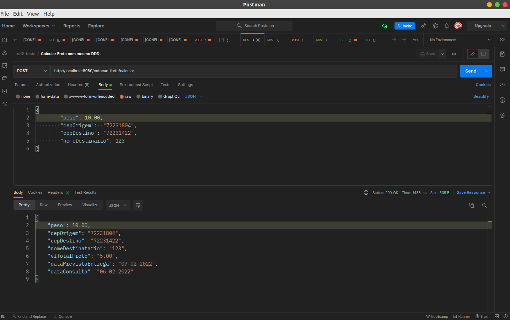
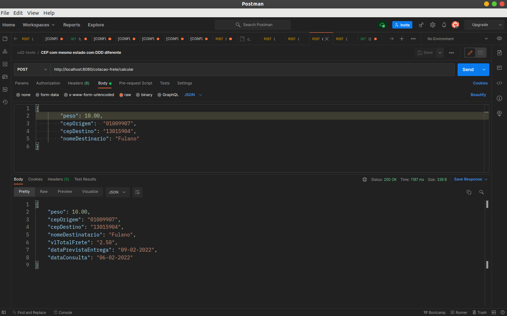
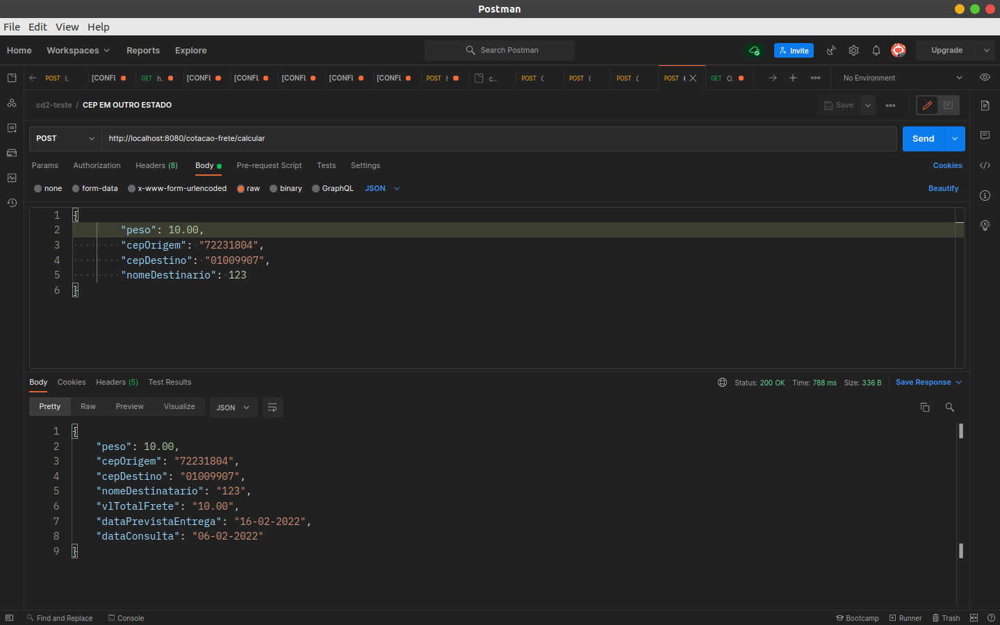
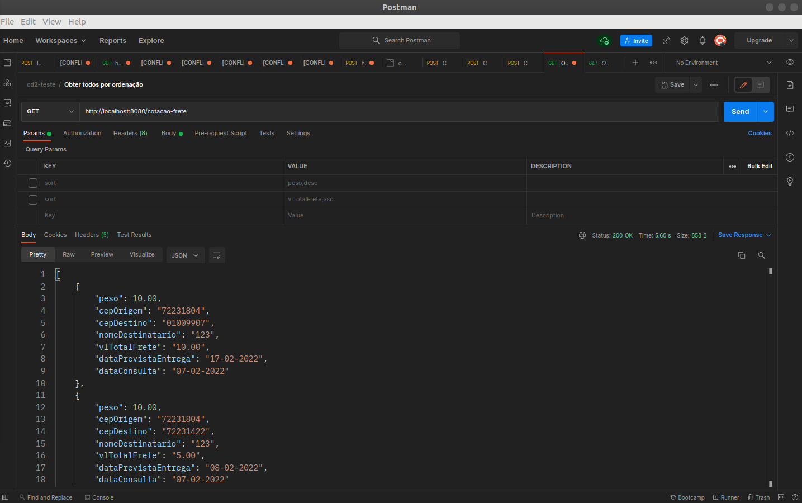
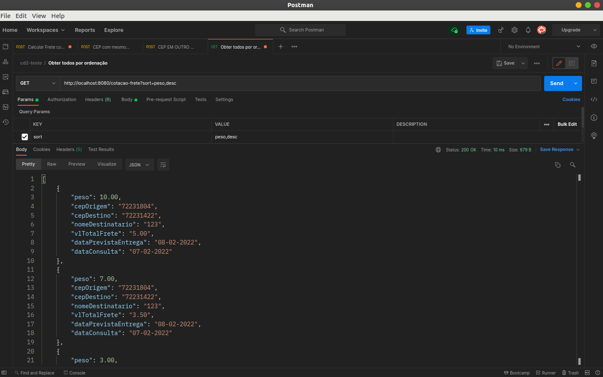
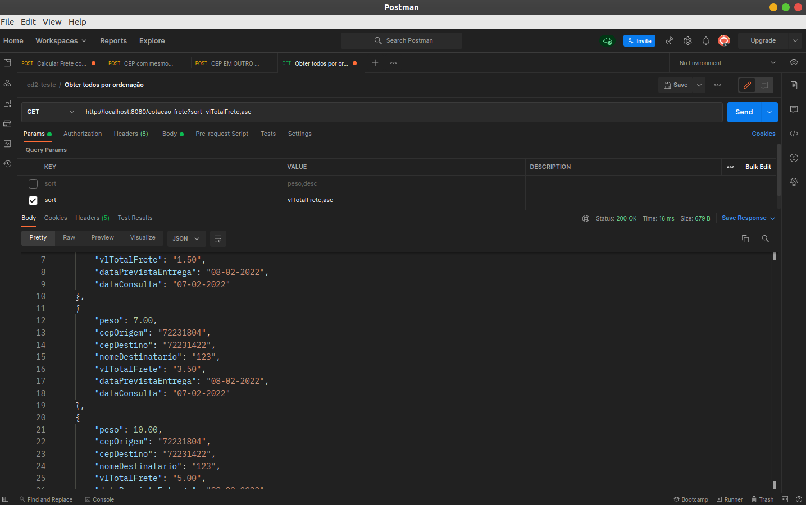

# API de Cotação de Encomendas
API com endpoint para o cálculo do preço do frete:

Você deve calcular o valor total do frete e a data prevista da entrega.

Considerar regras para calcular o valor do frete:
 * CEPs com DDDs iguais tem 50% de desconto no valor do frete e entrega prevista de 1 dia
 * CEPs de estados iguais tem 75% de desconto no valor do frete e entrega prevista de 3 dias
 * CEPs de estados diferentes não deve ser aplicado o desconto no valor do frete e entrega prevista de 10 dias
 * O valor do frete é cobrado pelo peso da encomenda, o valor para cada KG é R$1,00

Seu input de entrada deve ser “peso”, “cepOrigem”, “cepDestino” e “nomeDestinatario“

Você utilizará a API gratuita de consulta de CEP abaixo: 
Documentação da API: https://viacep.com.br/
Exemplo do GET: https://viacep.com.br/ws/<CEP_A_CONSULTAR>/json/

Endpoint pode ser público
Response/Output deve possuir: “vlTotalFrete” e “dataPrevistaEntrega”, “cepOrigem” e “cepDestino”
Deve ser persistido no banco os valores da cotação os valores consultados: “peso”, “cepOrigem”, “cepDestino”, “nomeDestinatario”, “vlTotalFrete”, “dataPrevistaEntrega” e “dataConsulta”

# Executando o projeto

Para  executar o projeto, é necessário executar o arquivo "SigaBemApplication.java", como "Java application" ou executando o comando mvn spring-boot:run

# End-points
Documentação: 
* A documentação da api foi gerada pelo swagger e pode ser encontrada no endpoint - http://localhost:8080/swagger-ui/index.html

API: 
* Endpoint da api - http://localhost:8080/cotacao-frete/calcular

# Banco em Memoria H2

Foi utilizado o banco de dados H2 para a fase de desenvolvimento.

Após o projeto receber o build, é iniciado o H2, que é encontrado através do endpoint: http://localhost:8080/h2-console/ dados de acesso:

* JDBC URL: jdbc:h2:mem:sigaBem_DB
* User: root
* Password: root

## Cliente REST para realizar testes - Postman

Para realizar os testes da aplicação, foi utilizado a ferramenta "Postman", escolhido pela facilidade de comunicação dos end-points.

## Endpoint usados:

## Cotação
Calcular preço frete:  
* Método POST 
* End-point: http://localhost:8080/cotacao-frete/calcular

* CEPs com DDDs iguais tem 50% de desconto no valor do frete e entrega prevista de 1 dia

  

* CEPs de estados iguais tem 75% de desconto no valor do frete e entrega prevista de 3 dias

  

* CEPs de estados diferentes não deve ser aplicado o desconto no valor do frete e entrega prevista de 10 dias

  

Ordenação de todas cotações:  
* Método GET 
* Obter todos por padrão default utiliza a ordenação por id e de forma acendente : http://localhost:8080/cotacao-frete/calcular

  

* Método GET 
* Ordenação por peso de forma decrecente : http://localhost:8080/cotacao-frete?sort=peso,desc

  

* Método GET 
* Ordenação por valor do frete de forma acendente : http://localhost:8080/cotacao-frete?sort=vlTotalFrete,asc

  

